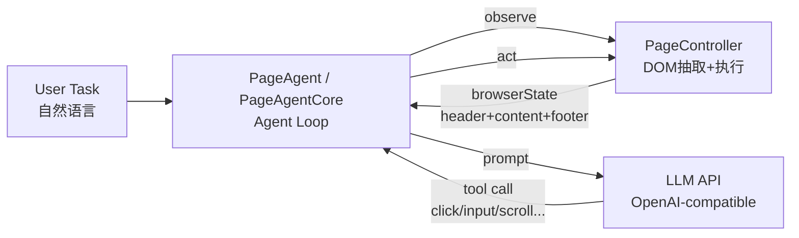
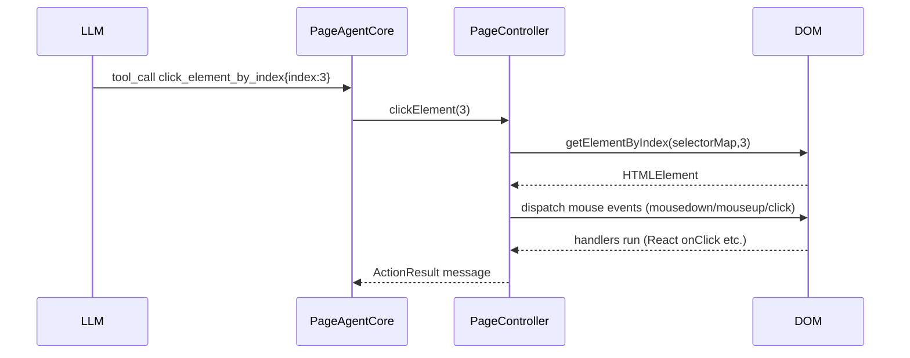
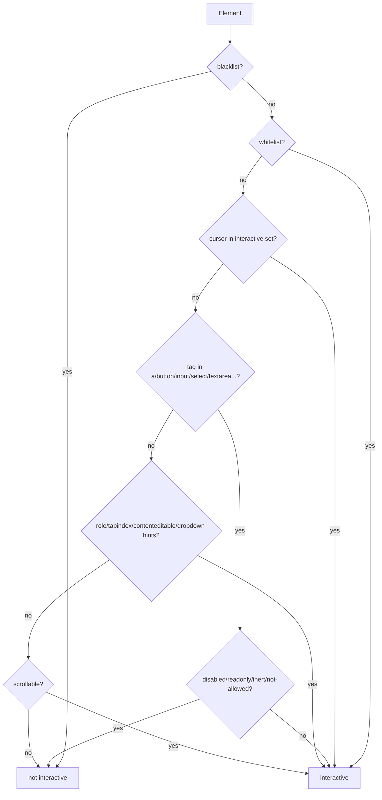
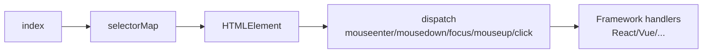

# Page Agent 项目分享文档（非官方说明）

> 目标读者：希望快速理解 Page Agent “怎么做到看页面→决定操作→点/填/滚”的开发者与产品同学。  
> 本文基于仓库当前实现整理（monorepo：`packages/*`）。

---

## 1) 这个项目是干什么的？

Page Agent 是一个“运行在真实网页里的 GUI Agent / 网页自动化助手”方案：用户输入自然语言任务（例如“打开 Docs，找到 Quick-Start，总结成 Markdown”），Agent 会在当前网页环境里：

1. **观察页面**（提取可交互元素、可见文本、页面信息）
2. **调用 LLM 做决策**（下一步要点哪个按钮、填哪个输入框、是否滚动/等待）
3. **执行动作**（点击、输入、选择下拉、滚动、执行 JS）
4. 循环直到 `done`

项目是一个 npm workspaces 的 monorepo，模块职责大致如下：

- `packages/page-agent/`：对外主入口（带 UI 面板的 PageAgent），通常你在网页里 new 的就是它。
- `packages/core/`：核心 agent loop（无 UI），负责 prompt 组装、工具注册、LLM 调用与重试、历史记录。
- `packages/page-controller/`：DOM 抽取与页面操作执行（click/input/scroll），可启用遮罩与高亮。
- `packages/llms/`：OpenAI-compatible 的 LLM Client（`POST {baseURL}/chat/completions`），并负责工具调用协议。
- `packages/ui/`：面板 UI（history、activity 等），与 core 解耦。
- `packages/website/`：官网/文档/在线 demo（包含“免费测试 LLM API”的默认配置）。

---

## 2) 原理整体介绍（从用户输入到真正点页面）

### 2.0 总览图（数据流）



### 2.1 Agent Loop：Observe → Think → Act

核心循环在 `packages/core/src/PageAgentCore.ts`：

1. **Observe**：每一步先拿 `browserState`（URL/标题/页面简化内容）
2. **Think**：把 `<instructions> + <agent_state> + <agent_history> + <browser_state>` 发给 LLM，让它选择一个工具调用
3. **Act**：执行工具（例如 `click_element_by_index` / `input_text`），并记录执行结果进 history

### 2.2 给 LLM 发送的“简化页面”是什么？

LLM 接收到的页面不是原始 HTML（比如 `outer.html` 那种全量 DOM + script + CSS），而是一个**面向操作的文本表示**：

- “可交互元素”会被编号：`[index]<tag attr=...>text />`
- 其它可见文本会以普通文本行出现
- 页面信息（URL、滚动位置等）放在 header/footer

示例（来自实际日志，格式说明）：

```text
Interactive elements ...
[Start of page]
*[0]<a aria-label=page-agent home />
*[3]<a aria-label=Docs />
*[5]<button type=button aria-label=Open navigation ... />
...
[End of page]
```

其中 `*[index]` 表示“新出现”的交互元素（`*` 是新元素标记），`index` 是后续操作的唯一入口（点击/输入都靠它）。

### 2.3 index 如何反向映射到真实 DOM？

在 `packages/page-controller/src/PageController.ts` 的 `updateTree()` 中会生成并缓存：

- `simplifiedHTML`：发给 LLM 的简化页面文本
- `selectorMap`：`index -> InteractiveElementDomNode`（内部保存了对真实节点的引用/定位信息）
- `elementTextMap`：`index -> 可读文本行`（用于日志与提示）

当 LLM 说“点击 index=3”，系统就能通过 `selectorMap` 找到对应的真实元素，再执行点击事件序列。



---

## 3) 最核心、最难模块：DOM 抽取与“可交互元素”判定 / 去重 / 编号

这一块决定了整个系统的上限：**看得准、编得稳、点得上**。

> 代码主入口：`packages/page-controller/src/dom/dom_tree/index.js`（DOM 抽取引擎）  
> 文本渲染：`packages/page-controller/src/dom/index.ts` 的 `flatTreeToString()`

### 3.1 从真实 DOM 到 FlatDomTree

整体链路：

1. `PageController.getBrowserState()` 会先 `await updateTree()`
2. `updateTree()` 调 `dom.getFlatTree(...)`
3. `dom.getFlatTree(...)` 调用 DOM 抽取引擎 `dom_tree/index.js` 遍历页面
4. 对每个节点计算：可见性、是否 top-element、是否 interactive、是否该分配 index
5. 生成一棵包含 `isInteractive`、`highlightIndex` 等字段的 FlatDomTree

```mermaid
flowchart TB
  S[getBrowserState()] --> UT[updateTree()]
  UT --> FT[getFlatTree()\nDOM -> FlatDomTree]
  FT --> HI[handleHighlighting()\nassign highlightIndex]
  HI --> ST[flatTreeToString()\nFlatDomTree -> simplifiedHTML]
  UT --> MAP[selectorMap / elementTextMap]
  ST --> BS[browserState.content]
```

### 3.2 “可交互元素”如何判定（isInteractiveElement）

核心判定函数：`isInteractiveElement(element)`。

它是**启发式**（heuristics）集合，而不是“读 onclick 就完事”。常用信号包括：

- **原生交互标签**：`a/button/input/select/textarea/...`
- **可达性语义**：`role="button"` / `tabindex` / `contenteditable`
- **cursor**：`cursor: pointer` 等（很多 React/Tailwind 的“div 按钮”依赖这个）
- **dropdown/按钮类启发式**：`.dropdown-toggle`、`aria-haspopup="true"` 等
- **事件线索**：DevTools 环境下的 `getEventListeners` / `getEventListenersForNode`（在很多运行环境不可用/不稳定）
- **可滚动容器**：overflow 为 auto/scroll 且滚动距离超过阈值，会标记为可交互（用于 scroll tool）

> 重要理解：React 的合成事件不是“不同于原生事件”的另一个系统。React 最终仍依赖浏览器原生事件（通常在根容器委托）。因此只要我们能触发原生 `click/mousedown/mouseup` 等冒泡事件，React 的 `onClick` 一般会被触发。

#### 3.2.1 交互判定示意（简化版决策树）

> 注意：这是“解释用示意图”，不等价于源码所有分支。



### 3.3 去重与编号：为什么不是所有 interactive 都会得到 index？

仅仅 “interactive=true” 还不够，它还要通过 `handleHighlighting()`：

- **可见性**：不可见元素直接跳过
- **top-element**：通常需要处在顶层（避免点到被遮挡的元素）。在 full-page 模式（viewportExpansion = -1）会放宽
- **父交互去重**：如果父节点已经编号，则子节点只有在被认为是“独立交互点”时才会再编号  
  这一步是为了解决：一个按钮里很多嵌套 div/span，不能都编号成“可点”，否则 LLM 不知道点哪一个、编号也会抖动。

最终编号发生在这里（概念描述）：`nodeData.highlightIndex = highlightIndex++`。

#### 3.3.1 “父交互去重”的例子

假设页面里有一个按钮结构（React/Tailwind 常见）：

```html
<a class="cursor-pointer">
  <div class="px-3 py-2">
    <span class="font-bold">Docs</span>
  </div>
</a>
```

如果不做去重，`a/div/span` 可能都满足“可交互信号”（cursor、role、监听器等），LLM 会看到多个 `[index]` 指向“同一件事”，导致：

- index 数量膨胀（噪音）
- DOM 微变动时 index 重排（抖动）
- LLM 更难选对“应该点哪个 index”

因此实现里：父节点被编号后，子节点只有在被认为是 “distinct interaction” 才能再次编号（否则会被合并到父交互里）。

### 3.4 例子：为什么日志里会出现 `div/span` 也被编号？

在 demo 页你可能看到类似：

```text
*[0]<a aria-label=page-agent home />
    *[1]<div />
        *[2]<span >page-agent 1.6.2 />
```

`div/span` 并非原生交互标签，但仍可能被判为可交互，常见原因是：

- CSS 使用了 `cursor: pointer`（例如 Tailwind `cursor-pointer`）
- 组件添加了 `role="button"` / `tabindex`
- 触发了 dropdown/按钮类启发式
- 在某些环境里能被探测到交互事件监听（不推荐依赖）

而 `[1]/[2]` 之所以在 `[0]` 已编号的情况下仍能拿到自己的 index，说明它们被判定为 “distinct interaction”（独立交互点），因此 `handleHighlighting()` 没有把它们去重掉。

### 3.5 “哪些节点会被过滤掉，不进入简化文本？”

过滤分两层：

**A. 抽取阶段过滤（不会进入 FlatDomTree 或不会被编号）**

- 显式忽略：`data-browser-use-ignore="true"` 或 `data-page-agent-ignore="true"`
- `aria-hidden="true"`：整棵子树会被跳过
- 不可见：`display:none` / `visibility:hidden` / 尺寸为 0
- blacklist：例如 demo 在 `packages/website/src/pages/home/HeroSection.tsx` 把 `#root` 放入 `interactiveBlacklist`
- 父交互去重：子节点即使 interactive，也可能因为“与父同一交互”而不编号

**B. 渲染阶段过滤（进入 FlatDomTree 但不会被打印成文本）**

- 文本去重：如果文本节点属于某个已编号的交互元素的子树，通常不再单独输出，避免重复噪音
- 普通文本倾向于只输出“顶层可见”的部分
- 属性白名单：简化文本只输出少量属性（例如 `id/name/placeholder/aria-*` 等），不会把所有 class/style 都打出来

---

## 4) 点击/输入是怎么执行的？（从 index 到触发 React onClick）

### 4.1 LLM 不是“直接写脚本”，而是选择工具调用

工具定义在 `packages/core/src/tools/index.ts`，例如：

- `click_element_by_index`：输入 `{ index }`
- `input_text`：输入 `{ index, text }`
- `select_dropdown_option`：输入 `{ index, text }`
- `scroll` / `wait` / `execute_javascript` 等

LLM 每一步必须选一个工具（macro tool 约束），Agent 执行工具后把结果写入 history。

### 4.2 点击实现（dispatch 原生事件序列）

当执行 `click_element_by_index`：

1. 通过 `selectorMap` 取到真实元素
2. 进入 `clickElement(element)`（在 `packages/page-controller/src/actions.ts`）
3. 依次派发 `mouseenter/mouseover/mousedown`，`focus()`，`mouseup/click`（事件 `bubbles: true`）

由于事件会冒泡，React 的合成事件系统通常能捕捉并触发组件的 `onClick`。



### 4.3 输入实现（尽量触发框架监听的 input/change）

输入走 `inputTextElement(element, text)`：

- 对 `<input>/<textarea>`：用“原生 value setter”设置 value，再派发 `input` 事件
- 对 `contenteditable`：先尝试 `beforeinput/input` 的合成流程，失败再 fallback 到 `document.execCommand('insertText')`

目标是尽量让 React/Vue/各种富文本编辑器“认为这是真实输入”，触发它们的 state 更新。

---

## 5) LLM 调用到底走哪里？为什么我没配 key 也能用？

在 website demo（Try it now）里，默认用的是“免费测试 LLM API”：

- 默认模型：`qwen3.5-flash`
- 默认 baseURL：`https://page-ag-testing-ohftxirgbn.cn-shanghai.fcapp.run`

它是一个 **OpenAI-compatible** 服务端（对外暴露 `/chat/completions`），由 `packages/llms/src/OpenAIClient.ts` 发起请求。

因此你即使没配 `LLM_API_KEY`，demo 也可能能跑（相当于项目方提供了测试代理/额度）。  
如果你想用自己的额度，需要在本地 dev 环境设置 `LLM_BASE_URL / LLM_MODEL_NAME / LLM_API_KEY`。

---

## 6) 项目优劣势与缺陷（真实工程视角）

### 6.1 优势

- **端侧执行**：核心操作发生在浏览器内，能直接操作真实页面，不依赖 headless/后端就能做很多事。
- **可控的工具调用闭环**：LLM 不是“随便输出文本”，而是被强制选择工具调用，降低失控与不可追踪性。
- **对现代前端友好**：click/input 通过原生事件序列触发，通常能触发 React 合成事件与常见组件库交互。
- **可观察性较好**：history/activity 事件流、可选 mask/highlight，利于 UI 展示与调试。

### 6.2 劣势 / 缺陷（尤其是核心 DOM 模块）

- **交互判定启发式不稳定**：`cursor`、class 名、事件监听探测等信号本质上噪音大，容易误判/漏判。
- **编号抖动**：页面轻微 DOM 变动就可能导致 index 重排；LLM 会“点错编号”，成功率下降。
- **top-element/viewport 策略取舍困难**：全页模式放宽 top-element 会带来更多候选与噪音；严格 top-element 又可能漏掉需要滚动/展开后才能点到的元素。
- **事件监听探测不可依赖**：`getEventListeners` 在大多数运行环境不可用（更多是 DevTools 能力），导致行为不一致。
- **对复杂控件仍可能失效**：某些组件只监听 pointer/touch，或富文本/编辑器需要框架实例配合；仅靠 mouse/input 事件可能不够。
- **隐私/安全边界需要更明确**：虽然端侧执行天然更隐私，但“把页面内容发给 LLM”仍涉及数据泄露风险，需要脱敏/过滤与可配置策略（代码里也有 TODO）。

### 6.3 可能的改进方向（建议）

- 增加 “可解释的交互原因”：为每个编号元素记录命中规则与置信度，便于定位误判来源。
- 提供 `interactiveMode: strict/balanced/aggressive`：让不同业务在“覆盖率 vs 精准度”之间可选。
- 做编号稳定化：用稳定 key（selector/path + 属性摘要）进行去抖或增量更新，降低 index 重排。
- 增强事件覆盖：在必要时补充 pointer/touch 事件序列，并提供可配置的 click/input 策略。

---

## 7) 一句话总结

Page Agent 的价值在于把“LLM 的语言能力”落到“真实网页的 GUI 操作”上；而它成败的关键在于：**DOM 抽取是否稳定、交互元素编号是否可靠、以及 index→真实元素的执行是否能覆盖足够多的现代前端组件**。
